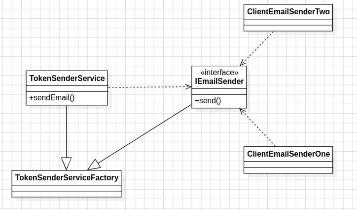

<h1>
    
    DESIGN PATTERN: FACTORY
</h1>
The Factory pattern is a creational design pattern that provides an interface for creating objects in a superclass but allows subclasses to alter the type of objects that will be created. This pattern promotes loose coupling by eliminating the need to bind application-specific classes into the code. In essence, it abstracts the instantiation process from the client code, allowing it to use a common interface to create new instances of objects without necessarily knowing their concrete classes. This approach enhances flexibility, scalability, and maintainability of the codebase.

<h2>
    
    About project
</h2>

<p>The Factory pattern was employed to decouple the actual email client from the effective email service. This was achieved by creating a communication interface between the domain service and the sending client. When the service is requested, the Factory pattern creates the correct instance of the service implementation. 
</p>

<h2>
    
    Class diagram
</h2>

<p align="center">
 
</p>

# Project structure

```
- 📁 src
  - 📁 main
    - 📁 java
      - 📁 com
        - 📁 example
          - 📁 domain
            - 📁 services
                  - 📄 TokenSenderService.java
            - 📁 util
              - 📁 adapters
                  - 📄 IEmailSender.java
          - 📁 main
            - 📁 factory
              - 📄 TokenSenderServiceFactory.js
          - 📁 shared
              - 📄 ClientEmailSenderOne.js
              - 📄 ClientEmailSenderTwo.js
        - 📁 resources
  - 📁 test
    - 📁 java
        - 📁 com
          - 📁 example
            - 📁 main
              - 📁 factory
                  - 📄 TokenSenderServiceFactoryTest.java

```
